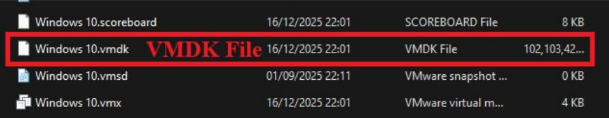
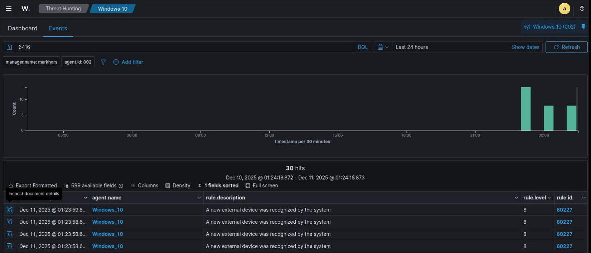

# DFIR-Case-Study
This report details a digital forensic investigation of a fileless malware attack initiated by a compromised USB device. The analysis reconstructs a multi-stage execution chain (VBS, BAT, and Python) used to inject shellcode, establish a reverse shell, and stage data for exfiltration.

> 🔍 **DFIR Case Study Report:** [Download / View Full PDF Report](./DFIR_Case_Study_Report.pdf)

## 1. Executive Summary / Abstract

This project investigates a fileless malware attack initiated through a malicious USB device. The attacker used a disguised VBS shortcut to trigger a multi-stage script chain (VBS -> BAT -> Python), leading to shellcode injection and a reverse shell connection. 

A Wazuh agent installed on the victim’s endpoint detected the unauthorized USB insertion, triggering a security alert and initiating the forensic investigation. Memory forensics using Volatility revealed the full attack chain, attacker IP, and evidence of data exfiltration. Disk forensics using Autopsy confirmed the malicious USB contents and attacker-created artifacts.

## 2. Case Background

An employee inserted an unauthorized USB device into a monitored corporate workstation. The organization’s Wazuh agent, which monitors endpoint activity, immediately detected the insertion of an external USB device. Since USB usage was prohibited under company policy, Wazuh flagged this as a high-severity alert. 

Upon forensic inspection, the USB contained a fake folder named `Toyota New Models`, which was actually a malicious VBS shortcut. When executed, it silently launched:
1. A hidden VBS script
2. A BAT file
3. A malicious Python script

The Python script downloaded shellcode, allocated Read/Write/Execute (RWX) memory, injected the payload, and established a reverse shell to the attacker. A memory dump and disk image were acquired for forensic analysis.

## 3. Scope and Objectives

**Scope:**
*   Memory forensics (RAM dump analysis)
*   Disk artifact analysis (VMDK analysis)
*   Wazuh alert correlation
*   Script chain reconstruction
*   Network connection analysis
*   Identification of attacker activity

**Objectives:**
*   Identify the initial infection vector.
*   Reconstruct the execution chain.
*   Detect shellcode injection.
*   Identify the attacker's IP address.
*   Confirm data exfiltration.
*   Correlate Wazuh alerts with the forensic timeline.

## 4. Evidence & Chain of Custody

**Case Number:** DF-LAB/2025-USB-001
**Offense:** Unauthorized Access / Malware Execution via USB

### Evidentiary Items

| Item # | Description of Evidence | Serial/ID | Condition | Quantity |
| :--- | :--- | :--- | :--- | :--- |
| **E01** | Seized Computer System (Victim PC) | PC-LAB-001 | Good | 1 |
| **E02** | USB Flash Drive (Attack Vector) | USB-ATTACK-001 | Minor scratches | 1 |
| **E03** | VMDK Disk Image (Forensic Copy) | IMG-VMDK-001 | New/Good | 1 |
| **E04** | Memory Dump (`memdump.mem`) | MEM-DUMP-001 | New/Good | 1 |
| **E05** | Malicious Folder `Toyota Car Models` | MAL-FOLDER-001 | N/A | 1 Folder |
| **E06** | Exfiltration ZIP File (`toyota.zip`) | ZIP-EXFIL-001 | N/A | 1 File |
| **E07** | Wazuh USB Detection Logs | LOG-WAZUH-001 | New/Good | Multiple |

## 5. Methodology & Analytical Toolset

The investigation followed a standard digital forensics lifecycle: Identification -> Collection -> Preservation -> Analysis -> Reporting.

| Tool | Version | Purpose |
| :--- | :--- | :--- |
| **FTK Imager** | 4.7.3.81 | Memory acquisition |
| **Autopsy** | 4.22.1 | Disk artifact analysis |
| **Volatility Workbench** | 3.0 | Memory forensics GUI |
| **Volatility 3** | 2.26.2 | Advanced memory analysis |
| **Wazuh** | 4.12 | Endpoint monitoring & alerting |

### 5.1. Imaging Process
*   **Disk Image Acquisition (VMDK):** The system was virtualized. The existing VMDK file was copied to the forensic workstation, and integrity hashes (MD5/SHA1) were generated.
*   **Memory Acquisition (RAM Image):** FTK Imager’s Memory Capture module was executed inside the VM to acquire full RAM (`memdump.mem`).

## 6. Forensic Analysis

### 6.1. Wazuh Log Analysis (Initial Detection)
The investigation was initiated based on a Wazuh security alert indicating a new external device was recognized on the victim machine.

*   **Date/Time:** Dec 11, 2025 @ 01:23:59
*   **Rule Triggered:** A new external device was recognized by the system (Rule ID: 60227)
*   **Event ID:** 6416

 

### 6.2. Disk Analysis (Autopsy)

**USB Device Connection:**
*   **Evidence Source:** `SYSTEM` hive -> `Enum\USBSTOR`
*   **Significance:** Confirmed a Kingston DataTraveler 3.0 USB device was connected, serving as the delivery mechanism.

**Malicious Files on Desktop:**
*   **Evidence Source:** File System View (`/Users/Markhor/Desktop/Toyota Car Models/`)
*   **Artifacts:** `New Toyota Models - Shortcut.lnk`, `New Toyota Models.vbs`, `run.bat`, `g.py`.
*   **Significance:** Indicates the payload was staged on the Desktop.

**Execution Traces (Prefetch Analysis):**
*   **VBS Script (`wscript.exe`):** Creation of `WSCRIPT.EXE-*.pf`. Confirms the `.vbs` script was executed by the user.
*   **BAT File (`cmd.exe`):** Creation of `CMD.EXE-*.pf`. Indicates the batch file (`run.bat`) executed as the second stage.
*   **Python Script (`python.exe`):** Creation of `PYTHON.EXE-*.pf`. Confirms the Python script (`g.py`) executed as the final malicious stage.
*   **Attacker Commands:** Prefetch files for `TASKLIST.EXE-*.pf` (process enumeration) and `SCHTASKS.EXE-*.pf` (persistence attempts) were identified.

**Exfiltration Archive:**
*   **Artifact:** `toyota.zip` created in the user’s `Documents` folder.
*   **Significance:** Created significantly later than the initial compromise, indicating active data staging for exfiltration by the attacker.

### 6.3. Volatile Memory Analysis (Volatility 3)

**Process Execution Tree (`windows.pstree`):**
The analysis showed that the attack originated from `explorer.exe` (user interaction). A clear multi-stage execution chain was observed:
1. `explorer.exe` launched `wscript.exe`
2. `wscript.exe` started `cmd.exe`
3. `cmd.exe` launched `python.exe` (PID 3796 - main payload)

**Command-Line Activity (`windows.cmdline`):**
*   `wscript.exe` executed `New Toyota Models.vbs`
*   `cmd.exe` executed `run.bat`
*   `python.exe` executed `g.py`

**In-Memory Code Injection (`windows.malfind`):**
Identified suspicious memory regions within `python.exe` (PID 3796) with Read/Write/Execute (RWX) permissions and no backing file on disk. Disassembly showed patterns associated with shellcode (XOR-based decryption routines), proving the fileless injection technique.

**Network Activity (`windows.netscan`):**
An established outbound connection was identified:
*   **Local IP:** 192.168.66.164
*   **Remote IP:** 192.168.66.154
*   **Port:** 4444 (Standard Meterpreter port)
*   **Associated Process:** `python.exe` (PID 3796)

## 7. Findings & Results

| Indicator Type | Value |
| :--- | :--- |
| **Attacker C2 IP** | `192.168.66.154:4444` |
| **Malicious PIDs** | `8948`, `7252`, `3796` |
| **Malicious Files** | `New Toyota Models.vbs`, `run.bat`, `g.py` |
| **Exfiltration File** | `toyota.zip` |
| **Initial Vector** | Unauthorized USB insertion (Wazuh Detected) |

## 8. Conclusion & Recommendations

### Conclusion
The investigation confirms a successful fileless malware attack delivered through social engineering via USB. Wazuh played a critical role in detecting the initial vector. Memory forensics revealed the full execution chain, shellcode injection, attacker IP, and exfiltration activity. Disk analysis corroborated the memory findings by providing execution artifacts (Prefetch) and staging evidence.

### Recommendations
1. **Enforce USB Blocking Policies:** Disable removable media via Group Policy or endpoint agents.
2. **Block Script Execution:** Restrict the execution of `.vbs` and `.bat` files for non-administrative users.
3. **Deploy EDR Solutions:** Enhance endpoint visibility to automatically kill processes exhibiting RWX memory injection behaviors.
4. **Monitor Outbound Traffic:** Implement strict egress filtering to prevent reverse shells on non-standard or unexpected ports (e.g., 4444).
5. **Security Awareness Training:** Train employees on the dangers of plugging in unknown USB devices and identifying disguised shortcuts.

---
*Disclaimer: This reverse engineering and malware analysis was conducted in a strict, closed, and controlled laboratory environment. The methods, artifacts, and findings documented in this report are provided solely for educational purposes, defensive security research, and incident response capability development.*
